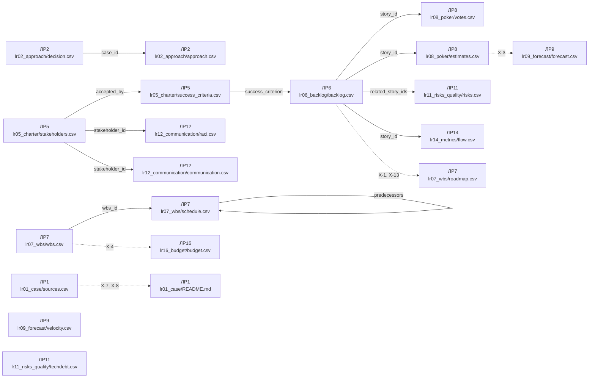

# Схеми артефактів курсу «Управління ІТ проєктами»

Згенеровано з `tools/schemas.json`, версія схеми **1.7.1**, оновлено 2026-09-05.

Файл не редагується руками: правиться спека, далі запускається
`python3 tools/generate_schema_docs.py`.


## Загальні конвенції

| Правило | Значення |
| --- | --- |
| `encoding` | utf-8 |
| `delimiter` | , |
| `decimal_separator` | . |
| `date_format` | YYYY-MM-DD |
| `list_separator` | ; |
| `header_language` | англійська, імена колонок точно як у спеці |
| `value_language` | українська |
| `empty_value` | порожня клітинка, не прочерк і не n/a |
| `no_total_rows` | рядків «Разом» у CSV немає, суми рахує валідатор |
| `no_merged_cells` | одна сутність це один рядок, об'єднаних клітинок немає |
| `single_source` | одне число має одне місце: оцінка тільки в estimates.csv, дати і статус тільки у flow.csv, беклог їх не дублює |
| `stable_ids` | ID фіксуються при створенні і не перенумеровуються до кінця семестру |

Формати ключів: `story_id` як `S-01`, `stakeholder_id` як `ST-01`, `wbs_id` як `1.2.3`, `release_id` як `REL-1`, `flow_item_id` як `F-001`, `risk_id` як `R-01`, `debt_id` як `D-01`, `activity_id` як `A-01`, `communication_id` як `C-01`, `budget_line_id` як `B-01`, `source_id` як `SRC-01`, `task_id` як `T-01`, `criterion_id` як `SC-01`.


## Словники значень

- `approach`: `predictive`, `adaptive`, `hybrid`
- `attitude`: `supporter`, `neutral`, `blocker`
- `budget_category`: `labor`, `tools`, `infrastructure`, `other`, `contingency`, `management_reserve`
- `channel`: `email`, `meeting`, `chat`, `report`, `demo`, `call`
- `comm_format`: `written`, `verbal`, `dashboard`, `presentation`
- `criterion`: `requirements`, `technology`, `release_cost`, `customer`, `contract`, `team`
- `debt_impact`: `low`, `medium`, `high`
- `debt_type`: `deliberate_prudent`, `deliberate_reckless`, `inadvertent_prudent`, `inadvertent_reckless`
- `final_points`: `0`, `1`, `2`, `3`, `5`, `8`, `13`, `21`
- `flow_type`: `feature`, `bug`, `tech_debt`, `other`
- `frequency`: `daily`, `weekly`, `biweekly`, `monthly`, `on_event`
- `influence`: `low`, `high`
- `interest`: `low`, `high`
- `lr02_case`: `C-1`, `C-2`, `C-3`
- `moscow_class`: `must`, `should`, `could`, `wont`
- `priority_method`: `moscow`, `rice`, `wsjf`
- `pull`: `predictive`, `adaptive`, `neutral`
- `raci_role`: `R`, `A`, `C`, `I`
- `risk_category`: `technical`, `external`, `organizational`, `project_management`
- `risk_status`: `open`, `closed`, `realized`
- `risk_strategy`: `avoid`, `mitigate`, `transfer`, `accept`, `escalate`
- `stakeholder_strategy`: `manage_closely`, `keep_satisfied`, `keep_informed`, `monitor`
- `story_points`: `0`, `1`, `2`, `3`, `5`, `8`, `13`, `21`, `?`
- `yes_no`: `yes`, `no`

## Файли

| Робота | Файл | Ключ | Мінімум рядків |
| :-: | --- | --- | :-: |
| ЛР1 | `lr01_case/sources.csv` | `source_id` | 3 |
| ЛР2 | `lr02_approach/approach.csv` | `case_id + criterion` | 18 |
| ЛР2 | `lr02_approach/decision.csv` | `case_id` | 3 |
| ЛР5 | `lr05_charter/stakeholders.csv` | `stakeholder_id` | 5 |
| ЛР5 | `lr05_charter/success_criteria.csv` | `criterion_id` | 3 |
| ЛР6 | `lr06_backlog/backlog.csv` | `story_id` | 15 |
| ЛР7 | `lr07_wbs/wbs.csv` | `wbs_id` | 12 |
| ЛР7 | `lr07_wbs/schedule.csv` | `task_id` | 10 |
| ЛР7 | `lr07_wbs/roadmap.csv` | `release_id` | 2 |
| ЛР8 | `lr08_poker/votes.csv` | `story_id + round + voter` | 12 |
| ЛР8 | `lr08_poker/estimates.csv` | `story_id` | 8 |
| ЛР9 | `lr09_forecast/velocity.csv` | `sprint` | 3 |
| ЛР9 | `lr09_forecast/forecast.csv` | `scenario` | 1 |
| ЛР11 | `lr11_risks_quality/risks.csv` | `risk_id` | 8 |
| ЛР11 | `lr11_risks_quality/techdebt.csv` | `debt_id` | 3 |
| ЛР12 | `lr12_communication/raci.csv` | `activity_id + stakeholder_id` | 18 |
| ЛР12 | `lr12_communication/communication.csv` | `item_id` | 5 |
| ЛР14 | `lr14_metrics/flow.csv` | `item_id` | 12 |
| ЛР16 | `lr16_budget/budget.csv` | `line_id` | 6 |

## Карта залежностей портфеля

Що з чого росте. Суцільна стрілка означає, що ключі одного файла живуть
у другому, пунктирна означає наскрізне правило звірки чисел. Схема
будується з цієї ж спеки, тому вона завжди відповідає колонкам вище.



Файли без стрілок теж обов'язкові: вони просто не мають спільних
ключів з іншими роботами.


### Джерела розтину кейсу, `lr01_case/sources.csv`

Робота ЛР1. Ключ: `source_id`. Мінімум рядків: 3.

| Колонка | Тип | Обов'язкова | Обмеження | Опис |
| --- | --- | :-: | --- | --- |
| `source_id` | ідентифікатор | так | формат `^SRC-\d{2}$`; унікальне | Ключ джерела, у тексті розтину ставиться як [SRC-01] |
| `claim` | текст | так |  | Твердження або подія розтину, які спираються на це джерело |
| `source_title` | текст | так |  | Назва документа так, як вона написана в самому документі |
| `publisher` | текст | так |  | Установа або видання, яке випустило документ |
| `url` | текст | так | формат `^https?://\S+$` | Пряме посилання на документ, не на головну сторінку сайту |
| `pub_date` | дата | так |  | Дата публікації документа |
| `accessed` | дата | так |  | Дата, коли команда відкривала документ |

Рядок заголовків:

```
source_id,claim,source_title,publisher,url,pub_date,accessed
```

Правила файла:

- `SRC-1` (error): Різних значень publisher щонайменше два: одна установа це одна точка зору
- `SRC-2` (error): Різних значень url щонайменше три: три рядки на один документ це одне джерело
- `SRC-3` (error): Щонайменше одне джерело поза доменом wikipedia.org
- `SRC-4` (warning): Дата accessed не раніша за pub_date

### Матриця критеріїв вибору підходу, `lr02_approach/approach.csv`

Робота ЛР2. Ключ: `case_id + criterion`. Мінімум рядків: 18.

| Колонка | Тип | Обов'язкова | Обмеження | Опис |
| --- | --- | :-: | --- | --- |
| `case_id` | значення зі словника | так | одне з: `C-1`, `C-2`, `C-3`; посилання на `lr02_approach/decision.csv:case_id` | Кейс курсу, описаний у роздатковому матеріалі ЛР2 |
| `criterion` | значення зі словника | так | одне з: `requirements`, `technology`, `release_cost`, `customer`, `contract`, `team` | Критерій вибору з таблиці лекції L2, шість штук на кожен кейс |
| `pull` | значення зі словника | так | одне з: `predictive`, `adaptive`, `neutral` | Куди цей критерій тягне саме в цьому кейсі |
| `argument` | текст | так |  | Факт з опису кейсу, через який критерій тягне саме туди, одним рядком |

Рядок заголовків:

```
case_id,criterion,pull,argument
```

Правила файла:

- `AP-1` (error): Пара case_id і criterion унікальна: один критерій оцінюється в кейсі один раз
- `AP-2` (error): У кожного case_id рівно шість рядків, по одному на кожен критерій зі словника
- `AP-3` (warning): Аргумент довший за 40 символів: переказ назви критерію аргументом не є
- `AP-4` (warning): У кожного кейсу щонайменше два різні значення pull: шість однакових стрілок означають, що кейс не читали
- `AP-5` (warning): Рядків зі значенням pull neutral не більше двох з вісімнадцяти: neutral це відсутність тяги, а не спосіб не вирішувати

### Рішення по кейсах ЛР2, `lr02_approach/decision.csv`

Робота ЛР2. Ключ: `case_id`. Мінімум рядків: 3.

| Колонка | Тип | Обов'язкова | Обмеження | Опис |
| --- | --- | :-: | --- | --- |
| `case_id` | значення зі словника | так | одне з: `C-1`, `C-2`, `C-3`; унікальне | Кейс курсу, один рядок на кейс |
| `chosen_approach` | значення зі словника | так | одне з: `predictive`, `adaptive`, `hybrid` | Обраний підхід до цього кейсу |
| `main_conflict` | значення зі словника | так | одне з: `requirements`, `technology`, `release_cost`, `customer`, `contract`, `team` | Критерій, який тягне проти обраного підходу і ціну якого команда платить свідомо |
| `contract_impact` | текст | так |  | Що зміниться у виборі, якщо змінити контрактну модель кейсу |
| `first_step` | текст | так |  | Перша дія PM у перший тиждень такого проєкту |

Рядок заголовків:

```
case_id,chosen_approach,main_conflict,contract_impact,first_step
```

Правила файла:

- `DC-1` (error): У файлі присутні всі три кейси курсу: C-1, C-2 і C-3
- `DC-2` (warning): contract_impact і first_step довші за 40 символів і не повторюють назву підходу
- `DC-3` (warning): Різних значень chosen_approach щонайменше два: три однакові відповіді на три різні кейси це привід до розмови

### Карта стейкхолдерів, `lr05_charter/stakeholders.csv`

Робота ЛР5. Ключ: `stakeholder_id`. Мінімум рядків: 5.

| Колонка | Тип | Обов'язкова | Обмеження | Опис |
| --- | --- | :-: | --- | --- |
| `stakeholder_id` | ідентифікатор | так | формат `^ST-\d{2}$`; унікальне | Ключ стейкхолдера, живе далі в RACI і плані комунікацій |
| `name_or_role` | текст | так |  | Роль або умовне ім'я персонажа, не реальна людина |
| `organization` | текст | ні |  | Сторона, яку представляє |
| `interest` | значення зі словника | так | одне з: `low`, `high` | Інтерес до проєкту за матрицею |
| `influence` | значення зі словника | так | одне з: `low`, `high` | Вплив на проєкт за матрицею |
| `attitude` | значення зі словника | так | одне з: `supporter`, `neutral`, `blocker` | Ставлення до проєкту |
| `strategy` | значення зі словника | так | одне з: `manage_closely`, `keep_satisfied`, `keep_informed`, `monitor` | Стратегія роботи, має відповідати квадранту |
| `owner` | текст | так |  | Хто веде ці відносини з вашого боку: ви або роль зі складу вашого варіанта |

Рядок заголовків:

```
stakeholder_id,name_or_role,organization,interest,influence,attitude,strategy,owner
```

Правила файла:

- `ST-1` (error): Стратегія відповідає квадранту: high/high це manage_closely, низький інтерес і високий вплив це keep_satisfied, високий інтерес і низький вплив це keep_informed, low/low це monitor
- `ST-2` (error): Щонайменше один стейкхолдер має стратегію manage_closely

### Критерії успіху проєкту, `lr05_charter/success_criteria.csv`

Робота ЛР5. Ключ: `criterion_id`. Мінімум рядків: 3.

| Колонка | Тип | Обов'язкова | Обмеження | Опис |
| --- | --- | :-: | --- | --- |
| `criterion_id` | ідентифікатор | так | формат `^SC-\d{2}$`; унікальне | Ключ критерію, живе далі в беклозі і в звіті про закриття |
| `criterion` | текст | так |  | Що саме вважається успіхом, одна фраза без слова «зручний» |
| `metric` | текст | так |  | Що міряємо: величина, а не побажання |
| `baseline` | текст | ні |  | Як зараз, до проєкту. Порожньо, якщо міряти нічого |
| `target` | текст | так |  | Цільове значення з числом і одиницею |
| `measure_how` | текст | так |  | Звідки беруться дані і коли вимірюємо |
| `accepted_by` | ідентифікатор | так | посилання на `lr05_charter/stakeholders.csv:stakeholder_id` | Стейкхолдер, який приймає цей критерій |

Рядок заголовків:

```
criterion_id,criterion,metric,baseline,target,measure_how,accepted_by
```

Правила файла:

- `SC-1` (error): У target є число: критерій без числа не приймається жодною стороною
- `SC-2` (error): measure_how не повторює target і називає джерело даних або момент виміру
- `SC-3` (warning): Різних значень accepted_by щонайменше два: якщо всі критерії приймає одна людина, карта стейкхолдерів у статуті не працює

### Беклог продукту, `lr06_backlog/backlog.csv`

Робота ЛР6. Ключ: `story_id`. Мінімум рядків: 15.

| Колонка | Тип | Обов'язкова | Обмеження | Опис |
| --- | --- | :-: | --- | --- |
| `story_id` | ідентифікатор | так | формат `^S-\d{2}$`; унікальне | Наскрізний ключ історії на весь семестр |
| `epic` | текст | так |  | Епік, до якого належить історія |
| `title` | текст | так |  | Коротка назва історії |
| `as_a` | текст | так |  | Роль користувача |
| `i_want` | текст | так |  | Що хоче зробити |
| `so_that` | текст | так |  | Яку цінність отримує |
| `acceptance_criteria` | текст | ні | список через `;` | Критерії приймання через крапку з комою, кожен перевірюваний. Обов'язкові для історій першого релізу, у далеких історіях лишаються порожніми свідомо |
| `priority_method` | значення зі словника | так | одне з: `moscow`, `rice`, `wsjf` | Метод пріоритезації, однаковий для всього беклогу |
| `priority_score` | текст | так |  | Значення методу: клас MoSCoW або число RICE чи WSJF |
| `priority_inputs` | текст | ні | список через `;` | Складники методу через крапку з комою у вигляді ключ=число: reach=400;impact=2;confidence=0.8;effort=1.5 для RICE, business_value=8;time_criticality=5;risk_reduction=3;job_size=3 для WSJF. Для MoSCoW порожньо |
| `rank` | ціле число | так | унікальне; не менше 1 | Місце в черзі, суцільна нумерація від 1 |
| `release` | ідентифікатор | ні | формат `^REL-\d{1,2}$` | Реліз, у який історія запланована. Порожньо, якщо історія ще чекає черги. Джерело правди складу релізу: roadmap.csv його не дублює |
| `success_criterion` | ідентифікатор | ні | посилання на `lr05_charter/success_criteria.csv:criterion_id` | Критерій успіху зі статуту, на який працює історія. Обов'язковий для історій першого релізу |

Рядок заголовків:

```
story_id,epic,title,as_a,i_want,so_that,acceptance_criteria,priority_method,priority_score,priority_inputs,rank,release,success_criterion
```

Правила файла:

- `BL-1` (error): Значення rank утворюють суцільний ряд від 1 до кількості історій без пропусків
- `BL-2` (error): Один priority_method на весь файл
- `BL-3` (error): У кожної історії з release REL-1 заповнені acceptance_criteria
- `BL-4` (error): У перший реліз REL-1 включені щонайменше вісім історій
- `BL-5` (error): У кожної історії з release REL-1 заповнений success_criterion
- `BL-6` (error): Для методів rice і wsjf priority_inputs містить усі складники методу, а priority_score дорівнює результату формули з похибкою до 0.1
- `BL-7` (error): Для методу moscow priority_score це must, should, could або wont
- `BL-8` (warning): Жодна історія без релізу не стоїть у черзі вище за історію першого релізу
- `BL-9` (warning): Для методу moscow частка must серед історій першого релізу не перевищує 60 відсотків
- `BL-10` (warning): Різних епіків у беклозі щонайменше три
- `BL-11` (warning): Жодна історія першого релізу не має final_estimate 21 в estimates.csv: історія на цілий спринт це епік

### WBS проєкту, `lr07_wbs/wbs.csv`

Робота ЛР7. Ключ: `wbs_id`. Мінімум рядків: 12.

| Колонка | Тип | Обов'язкова | Обмеження | Опис |
| --- | --- | :-: | --- | --- |
| `wbs_id` | ідентифікатор | так | формат `^\d+(\.\d+)*$`; унікальне | Ієрархічний номер вузла |
| `parent_id` | ідентифікатор | ні |  | Батьківський вузол, порожньо тільки у кореня |
| `name` | текст | так |  | Назва пакета робіт |
| `level` | ціле число | так | не менше 1 | Рівень вкладеності, дорівнює кількості сегментів wbs_id |
| `deliverable` | текст | так |  | Що є результатом вузла, іменник, не дієслово |
| `owner` | текст | так |  | Відповідальний за пакет |
| `estimate_hours` | число | так | не менше 0 | Оцінка в годинах |

Рядок заголовків:

```
wbs_id,parent_id,name,level,deliverable,owner,estimate_hours
```

Правила файла:

- `WBS-1` (error): level дорівнює кількості сегментів у wbs_id
- `WBS-2` (error): parent_id існує у файлі і є префіксом wbs_id
- `WBS-3` (error): Правило 100%: estimate_hours нелистового вузла дорівнює сумі дітей
- `WBS-4` (warning): У WBS присутні пакети управління, тестування і розгортання: типова забута робота

### Календарний план проєкту, `lr07_wbs/schedule.csv`

Робота ЛР7. Ключ: `task_id`. Мінімум рядків: 10.

| Колонка | Тип | Обов'язкова | Обмеження | Опис |
| --- | --- | :-: | --- | --- |
| `task_id` | ідентифікатор | так | формат `^T-\d{2}$`; унікальне | Ключ роботи календарного плану |
| `wbs_id` | ідентифікатор | так | посилання на `lr07_wbs/wbs.csv:wbs_id` | Листовий вузол WBS, до якого належить робота |
| `name` | текст | так |  | Назва роботи або віхи |
| `duration_days` | ціле число | так | не менше 0 | Тривалість у робочих днях; у віхи 0 |
| `predecessors` | список ідентифікаторів | ні | формат `^T-\d{2}$`; посилання на `lr07_wbs/schedule.csv:task_id` | Попередники через крапку з комою, зв'язок finish to start; порожньо у стартових робіт |
| `milestone` | значення зі словника | так | одне з: `yes`, `no` | Чи є рядок віхою |
| `float_days` | ціле число | так | не менше 0 | Повний резерв роботи в днях, порахований студентом |
| `is_critical` | значення зі словника | так | одне з: `yes`, `no` | Чи лежить робота на критичному шляху |

Рядок заголовків:

```
task_id,wbs_id,name,duration_days,predecessors,milestone,float_days,is_critical
```

Правила файла:

- `SCH-1` (error): У графі залежностей немає циклів: робота не може бути власним попередником навіть через ланцюг
- `SCH-2` (error): float_days дорівнює повному резерву, порахованому за тривалостями і залежностями
- `SCH-3` (error): is_critical дорівнює yes рівно в тих робіт, чий повний резерв нульовий
- `SCH-4` (warning): У плані щонайменше дві віхи: без контрольних точок графік не має чим міряти рух
- `SCH-5` (warning): Віха має нульову тривалість: milestone це подія, а не робота

### Дорожня карта релізів, `lr07_wbs/roadmap.csv`

Робота ЛР7. Ключ: `release_id`. Мінімум рядків: 2.

| Колонка | Тип | Обов'язкова | Обмеження | Опис |
| --- | --- | :-: | --- | --- |
| `release_id` | ідентифікатор | так | формат `^REL-\d{1,2}$`; унікальне | Ключ релізу |
| `name` | текст | так |  | Назва релізу або milestone |
| `target_date` | дата | так |  | Цільова дата |
| `goal` | текст | так |  | Яку цінність дає реліз |

Рядок заголовків:

```
release_id,name,target_date,goal
```

Правила файла:

- `RM-1` (warning): Кожен release_id зустрічається щонайменше в одній історії lr06_backlog/backlog.csv: реліз без історій це дата, а не реліз
- `RM-3` (warning): Дати релізів зростають за номером

### Голоси сесії planning poker, `lr08_poker/votes.csv`

Робота ЛР8. Ключ: `story_id + round + voter`. Мінімум рядків: 12.

| Колонка | Тип | Обов'язкова | Обмеження | Опис |
| --- | --- | :-: | --- | --- |
| `story_id` | ідентифікатор | так | посилання на `lr06_backlog/backlog.csv:story_id` | Історія, яку оцінювали |
| `round` | ціле число | так | не менше 1 | Номер раунду, від 1 |
| `voter` | текст | так |  | Хто голосував, ім'я або нік однаково по всіх рядках |
| `vote` | значення зі словника | так | одне з: `0`, `1`, `2`, `3`, `5`, `8`, `13`, `21`, `?` | Картка Фібоначчі, знак питання дозволений |

Рядок заголовків:

```
story_id,round,voter,vote
```

Правила файла:

- `PK-1` (error): У межах пари story_id і round кожен voter голосує один раз
- `PK-2` (error): Кожен story_id існує в беклозі
- `PK-3` (warning): У кожному раунді щонайменше три голоси: сесія командна

### Підсумкові оцінки історій, `lr08_poker/estimates.csv`

Робота ЛР8. Ключ: `story_id`. Мінімум рядків: 8.

| Колонка | Тип | Обов'язкова | Обмеження | Опис |
| --- | --- | :-: | --- | --- |
| `story_id` | ідентифікатор | так | посилання на `lr06_backlog/backlog.csv:story_id`; унікальне | Історія |
| `final_estimate` | значення зі словника | так | одне з: `0`, `1`, `2`, `3`, `5`, `8`, `13`, `21` | Узгоджена оцінка в story points |
| `rounds` | ціле число | так | не менше 1 | Скільки раундів знадобилось |
| `spread_note` | текст | ні |  | Причина розкиду, якщо він був |

Рядок заголовків:

```
story_id,final_estimate,rounds,spread_note
```

Правила файла:

- `ES-1` (error): rounds дорівнює максимальному round цієї історії у votes.csv
- `ES-2` (error): Якщо rounds більше одного, spread_note не порожній
- `ES-3` (error): Кожен story_id з votes.csv має рядок в estimates.csv

### Історія velocity команди, `lr09_forecast/velocity.csv`

Робота ЛР9. Ключ: `sprint`. Мінімум рядків: 3.

| Колонка | Тип | Обов'язкова | Обмеження | Опис |
| --- | --- | :-: | --- | --- |
| `sprint` | ціле число | так | унікальне; не менше 1 | Номер спринта |
| `start_date` | дата | так |  | Початок спринта |
| `end_date` | дата | так |  | Кінець спринта |
| `points_committed` | число | так | не менше 0 | Взято в спринт |
| `points_done` | число | так | не менше 0 | Завершено за Definition of Done |

Рядок заголовків:

```
sprint,start_date,end_date,points_committed,points_done
```

Правила файла:

- `VL-1` (error): end_date пізніша за start_date
- `VL-2` (error): Номери спринтів суцільні, без пропусків

### Прогноз дати релізу, `lr09_forecast/forecast.csv`

Робота ЛР9. Ключ: `scenario`. Мінімум рядків: 1.

| Колонка | Тип | Обов'язкова | Обмеження | Опис |
| --- | --- | :-: | --- | --- |
| `scenario` | текст | так | унікальне | Назва сценарію, наприклад весь беклог або тільки must have |
| `remaining_points` | число | так | не менше 0 | Скільки points лишилось у сценарії |
| `simulations` | ціле число | так | не менше 1000 | Кількість прогонів Monte Carlo |
| `p50_sprints` | число | так | не менше 0 | Спринтів за медіаною |
| `p85_sprints` | число | так | не менше 0 | Спринтів за 85-м перцентилем |
| `p50_date` | дата | так |  | Дата за медіаною |
| `p85_date` | дата | так |  | Дата за 85-м перцентилем |

Рядок заголовків:

```
scenario,remaining_points,simulations,p50_sprints,p85_sprints,p50_date,p85_date
```

Правила файла:

- `FC-1` (error): p85_sprints не менше за p50_sprints, p85_date не раніша за p50_date
- `FC-2` (error): remaining_points дорівнює сумі final_estimate історій сценарію

### Реєстр ризиків, `lr11_risks_quality/risks.csv`

Робота ЛР11. Ключ: `risk_id`. Мінімум рядків: 8.

| Колонка | Тип | Обов'язкова | Обмеження | Опис |
| --- | --- | :-: | --- | --- |
| `risk_id` | ідентифікатор | так | формат `^R-\d{2}$`; унікальне | Ключ ризику |
| `category` | значення зі словника | так | одне з: `technical`, `external`, `organizational`, `project_management` | Категорія за структурою ризиків |
| `cause` | текст | так |  | Причина, факт теперішнього часу |
| `event` | текст | так |  | Подія, яка може статися |
| `consequence` | текст | так |  | Наслідок для проєкту |
| `probability` | ціле число | так | від 1 до 5 | Імовірність від 1 до 5 |
| `impact` | ціле число | так | від 1 до 5 | Вплив від 1 до 5 |
| `score` | ціле число | так |  | Добуток probability на impact |
| `strategy` | значення зі словника | так | одне з: `avoid`, `mitigate`, `transfer`, `accept`, `escalate` | Стратегія реагування |
| `owner` | текст | так |  | Власник ризику, одна людина на ім'я |
| `trigger` | текст | так |  | Сигнал, за яким вмикається план |
| `response_plan` | текст | так |  | Що робимо, коли спрацював тригер |
| `status` | значення зі словника | так | одне з: `open`, `closed`, `realized` | Стан ризику |
| `related_story_ids` | список ідентифікаторів | ні | посилання на `lr06_backlog/backlog.csv:story_id` | Історії, яких стосується ризик |

Рядок заголовків:

```
risk_id,category,cause,event,consequence,probability,impact,score,strategy,owner,trigger,response_plan,status,related_story_ids
```

Правила файла:

- `RK-1` (error): score дорівнює probability помножити на impact
- `RK-2` (error): У реєстрі є щонайменше один ризик кожної категорії
- `RK-3` (error): Власник це одна людина, значення «команда» або «всі» не приймається
- `RK-4` (warning): Для score від 15 і вище план реагування описаний кроками, а не одним словом

### Реєстр технічного боргу, `lr11_risks_quality/techdebt.csv`

Робота ЛР11. Ключ: `debt_id`. Мінімум рядків: 3.

| Колонка | Тип | Обов'язкова | Обмеження | Опис |
| --- | --- | :-: | --- | --- |
| `debt_id` | ідентифікатор | так | формат `^D-\d{2}$`; унікальне | Ключ запису |
| `area` | текст | так |  | Де саме борг: модуль, процес, документація |
| `description` | текст | так |  | У чому борг |
| `type` | значення зі словника | так | одне з: `deliberate_prudent`, `deliberate_reckless`, `inadvertent_prudent`, `inadvertent_reckless` | Квадрант Фаулера |
| `origin` | текст | так |  | Звідки взявся: рішення, спринт, обставина |
| `impact` | значення зі словника | так | одне з: `low`, `medium`, `high` | Вплив на швидкість або якість |
| `effort_hours` | число | так | не менше 0 | Оцінка вартості повернення боргу |
| `plan` | текст | так |  | Коли і як гасимо |
| `owner` | текст | так |  | Відповідальний |
| `due_sprint` | ціле число | так | не менше 1 | Спринт, до якого запланована робота |

Рядок заголовків:

```
debt_id,area,description,type,origin,impact,effort_hours,plan,owner,due_sprint
```

Правила файла:

- `TD-1` (warning): Щонайменше один запис має тип deliberate_prudent: свідомий борг з рішенням у беклозі

### Матриця RACI у довгому форматі, `lr12_communication/raci.csv`

Робота ЛР12. Ключ: `activity_id + stakeholder_id`. Мінімум рядків: 18.

| Колонка | Тип | Обов'язкова | Обмеження | Опис |
| --- | --- | :-: | --- | --- |
| `activity_id` | ідентифікатор | так | формат `^A-\d{2}$` | Ключ активності, повторюється в рядках однієї активності |
| `activity` | текст | так |  | Назва активності, однакова для всіх рядків одного activity_id |
| `stakeholder_id` | ідентифікатор | так | посилання на `lr05_charter/stakeholders.csv:stakeholder_id` | Учасник з карти стейкхолдерів |
| `role` | значення зі словника | так | одне з: `R`, `A`, `C`, `I` | Роль у цій активності |

Рядок заголовків:

```
activity_id,activity,stakeholder_id,role
```

Правила файла:

- `RC-1` (error): Пара activity_id і stakeholder_id унікальна
- `RC-2` (error): Рівно одна роль A на кожну активність
- `RC-3` (error): Щонайменше одна роль R на кожну активність
- `RC-4` (error): Текст activity однаковий у всіх рядках одного activity_id
- `RC-5` (warning): Активностей щонайменше шість, широку таблицю для людей команда показує в README

### План комунікацій, `lr12_communication/communication.csv`

Робота ЛР12. Ключ: `item_id`. Мінімум рядків: 5.

| Колонка | Тип | Обов'язкова | Обмеження | Опис |
| --- | --- | :-: | --- | --- |
| `item_id` | ідентифікатор | так | формат `^C-\d{2}$`; унікальне | Ключ рядка плану |
| `stakeholder_id` | ідентифікатор | так | посилання на `lr05_charter/stakeholders.csv:stakeholder_id` | Кому адресовано |
| `message` | текст | так |  | Що саме повідомляємо |
| `channel` | значення зі словника | так | одне з: `email`, `meeting`, `chat`, `report`, `demo`, `call` | Канал |
| `frequency` | значення зі словника | так | одне з: `daily`, `weekly`, `biweekly`, `monthly`, `on_event` | Частота або подія-тригер |
| `format` | значення зі словника | так | одне з: `written`, `verbal`, `dashboard`, `presentation` | Форма подачі |
| `owner` | текст | так |  | Хто відповідає за цю комунікацію |

Рядок заголовків:

```
item_id,stakeholder_id,message,channel,frequency,format,owner
```

Правила файла:

- `CM-1` (error): Кожен стейкхолдер зі стратегією manage_closely або keep_satisfied має щонайменше один рядок

### Потік задач: завершені картки дошки ЛР4 і картки двох реальних спринтів M5, `lr14_metrics/flow.csv`

Робота ЛР14. Ключ: `item_id`. Мінімум рядків: 12.

| Колонка | Тип | Обов'язкова | Обмеження | Опис |
| --- | --- | :-: | --- | --- |
| `item_id` | ідентифікатор | так | формат `^F-\d{3}$`; унікальне | Ключ картки на дошці |
| `story_id` | ідентифікатор | ні | посилання на `lr06_backlog/backlog.csv:story_id` | Історія беклогу, якщо картка з неї |
| `type` | значення зі словника | так | одне з: `feature`, `bug`, `tech_debt`, `other` | Тип роботи |
| `created_date` | дата | так |  | Коли картка з'явилась |
| `start_date` | дата | так |  | Коли взяли в роботу |
| `done_date` | дата | так |  | Коли завершили за DoD |
| `blocked_days` | ціле число | так | не менше 0 | Скільки днів картка стояла заблокованою |

Рядок заголовків:

```
item_id,story_id,type,created_date,start_date,done_date,blocked_days
```

Правила файла:

- `FL-1` (error): created_date не пізніше start_date, start_date не пізніше done_date
- `FL-2` (error): blocked_days не перевищує кількість днів між start_date і done_date
- `FL-3` (warning): Рядків достатньо для перцентиля: щонайменше дванадцять завершених карток

### Кошторис проєкту, `lr16_budget/budget.csv`

Робота ЛР16. Ключ: `line_id`. Мінімум рядків: 6.

| Колонка | Тип | Обов'язкова | Обмеження | Опис |
| --- | --- | :-: | --- | --- |
| `line_id` | ідентифікатор | так | формат `^B-\d{2}$`; унікальне | Ключ рядка кошторису |
| `category` | значення зі словника | так | одне з: `labor`, `tools`, `infrastructure`, `other`, `contingency`, `management_reserve` | Категорія витрат або резерву |
| `role_or_item` | текст | так |  | Роль для праці або назва позиції |
| `hours` | число | ні | не менше 0 | Години, порожньо для непогодинних позицій |
| `rate` | число | ні | не менше 0 | Ставка за годину |
| `amount` | число | так | не менше 0 | Сума рядка в валюті проєкту |
| `note` | текст | ні |  | Пояснення, звідки взялась цифра |

Рядок заголовків:

```
line_id,category,role_or_item,hours,rate,amount,note
```

Правила файла:

- `BG-1` (error): Якщо заповнені hours і rate, amount дорівнює їх добутку з точністю до двох знаків
- `BG-2` (error): Рівно один рядок категорії contingency
- `BG-3` (error): Не більше одного рядка категорії management_reserve, і він не входить у baseline
- `BG-4` (warning): Сума contingency відповідає відсотку від прямих витрат, названому в README
- `BG-5` (error): Категорія labor має щонайменше два рядки: кошторис однієї ролі це не кошторис команди

## Наскрізні правила

| Правило | Рівень | Опис |
| :-: | :-: | --- |
| `X-1` | error | Кожен story_id в estimates.csv, votes.csv, roadmap.csv, risks.csv і flow.csv існує в backlog.csv |
| `X-2` | error | Кожен stakeholder_id у raci.csv, communication.csv і success_criteria.csv існує в stakeholders.csv |
| `X-3` | error | remaining_points у forecast.csv дорівнює сумі final_estimate історій сценарію з estimates.csv |
| `X-4` | warning | Сума hours категорії labor у budget.csv відрізняється від суми estimate_hours листових вузлів wbs.csv не більше ніж на 15 відсотків |
| `X-5` | warning | Кожна історія з release REL-1 у backlog.csv присутня в estimates.csv: план першого релізу оцінений |
| `X-6` | error | Версія схеми в README.md репозиторію команди збігається з версією цієї спеки |
| `X-7` | error | Кожен source_id із lr01_case/sources.csv згадується в тексті lr01_case/README.md у форматі [SRC-01] |
| `X-8` | error | Кожне посилання [SRC-..] у тексті lr01_case/README.md існує в sources.csv |
| `X-9` | error | Кожен case_id із lr02_approach/decision.csv має рівно шість рядків у lr02_approach/approach.csv, по одному на кожен критерій |
| `X-10` | error | Критерій main_conflict із lr02_approach/decision.csv має в lr02_approach/approach.csv рядок цього ж кейсу зі значенням pull, протилежним обраному підходу |
| `X-11` | error | Кожен wbs_id у lr07_wbs/schedule.csv вказує на листовий вузол lr07_wbs/wbs.csv: календарний план планує роботу, а не заголовок розділу |
| `X-12` | warning | Кожен листовий вузол lr07_wbs/wbs.csv зустрічається щонайменше в одній роботі lr07_wbs/schedule.csv: запланована робота без місця в календарі не робиться ніколи |
| `X-13` | error | Кожне значення release у lr06_backlog/backlog.csv існує в lr07_wbs/roadmap.csv |
| `X-14` | warning | Кожен criterion_id зі lr05_charter/success_criteria.csv згаданий щонайменше в одній історії першого релізу |

## Артефакти у Markdown

| Робота | Файл | Що містить |
| :-: | --- | --- |
| ЛР1 | `README.md` | Прізвище і GitHub-логін, підгрупа, тема, номер варіанта вхідних умов, посилання на трекер і дошку, версія схеми артефактів. |
| ЛР1 | `lr01_case/README.md` | Кейс із перевірюваними джерелами, патерни провалу, висновки для власного проєкту. |
| ЛР2 | `lr02_approach/README.md` | Розбір трьох кейсів словами: конфлікт критеріїв, ціна вибору, стрес-тест контрактом і підхід для власної теми. Матриця і рішення лежать поруч у approach.csv і decision.csv. |
| ЛР3 | `lr03_sprint_simulation/sprint_log.md` | Самостійна робота ЛР3: ціль спринта, оцінки і ємність, три дні, реакція на конверти, огляд, ретроспектива. Копіюється під логін виконавця, балів не дає, є входом у ЛР4. |
| ЛР4 | `lr04_kanban/README.md` | Definition of Workflow, WIP-ліміти і правило їх дотримання, дванадцять карток із трьома датами, наслідки конвертів, cycle time і вузьке місце. Балів не дає, є входом у ЛР14. |
| ЛР5 | `lr05_charter/README.md` | Мета, business case з порівнянням варіантів рішення, обсяг з переліком «не робимо», обмеження зі свого варіанта, пояснення критеріїв успіху і матриця інтерес-вплив. Критерії лежать поруч у success_criteria.csv, стейкхолдери у stakeholders.csv. |
| ЛР6 | `lr06_backlog/README.md` | Обраний метод пріоритезації і чому саме він, розрахунок пріоритетів, нарізка першого релізу проти строку і ємності вашого варіанта, посилання на трекер. |
| ЛР6 | `lr06_backlog/dor.md` | За яких умов історію можна брати в спринт: перелік умов, межа розумного і те, що свідомо не вимагається. |
| ЛР7 | `lr07_wbs/README.md` | Стеля годин зі складу команди варіанта, як перевіряли правило 100%, що свідомо поза обсягом, критичний шлях проти строку варіанта, віхи і логіка нарізки релізів. |
| ЛР8 | `lr08_poker/README.md` | Інструмент, склад учасників, історії з найбільшим розкидом і що з'ясувалося в розмові. |
| ЛР9 | `lr09_forecast/README.md` | Як рахували, що означає P50 і P85 для замовника, яку дату команда називає вголос. |
| ЛР10 | `lr10_demo/review.md` | Результат валідатора, перевірка наскрізності, три зауваження з адресами файлів і рядків, одна знахідка. Балів не дає. |
| ЛР10 | `lr10_demo/README.md` | Рішення по кожному отриманому зауваженню з виконавцем і датою, відхилення з причиною. Балів не дає. |
| ЛР11 | `lr11_risks_quality/README.md` | Топ ризиків червоної зони, як працює процес перегляду реєстру, звідки взявся техборг. |
| ЛР11 | `lr11_risks_quality/dod.md` | Чек-лист умов, за яких робота вважається завершеною. Спільний для всіх історій. |
| ЛР12 | `lr12_communication/README.md` | Широка таблиця RACI для читання людиною і пояснення спірних призначень A. |
| ЛР13 | `lr13_roleplay/dialogue.md` | Три відповіді стейкхолдерам, другі репліки після конвертів, таблиця ескалації. Копіюється під логін виконавця, балів не дає, є входом у ЛР15. |
| ЛР14 | `lr14_metrics/README.md` | Діагноз за еталонними даними курсу і за власними flow-метриками з flow.csv, рекомендації команді. |
| ЛР15 | `lr15_status_report/README.md` | Звіт за шаблоном курсу: стан, прогрес, ризики, рішення, яких потребує замовник. |
| ЛР15 | `lr15_status_report/change_request.md` | Що просить замовник, скільки це коштує в обсязі, строку, бюджеті, якості і ризиках, яке рішення ухвалено: approve, reject або defer. |
| ЛР16 | `lr16_budget/README.md` | Валюта проєкту, відсоток contingency і звідки він узявся, порівняння Fixed Price проти Time and Material і обрана модель. |
| ЛР17 | `lr17_ai_assistant/README.md` | Що автоматизували, промпти, і головне: де інструмент помилявся і як це виявили. |
| ЛР18 | `lr18_closure/closure_report.md` | Що прийнято, що не завершено, як передається продукт, яка цінність отримана, lessons learned. Здається в репозиторій до пари захисту. |

## Рівні перевірки

Валідатор працює трьома рівнями. Механіка: файл існує, колонки на місці,
типи і словники витримані. Внутрішні правила файла: перелічені вище в
кожному розділі. Наскрізні зв'язки між файлами: розділ вище. Рівень
`error` блокує здачу, рівень `warning` показується студенту і не блокує.

